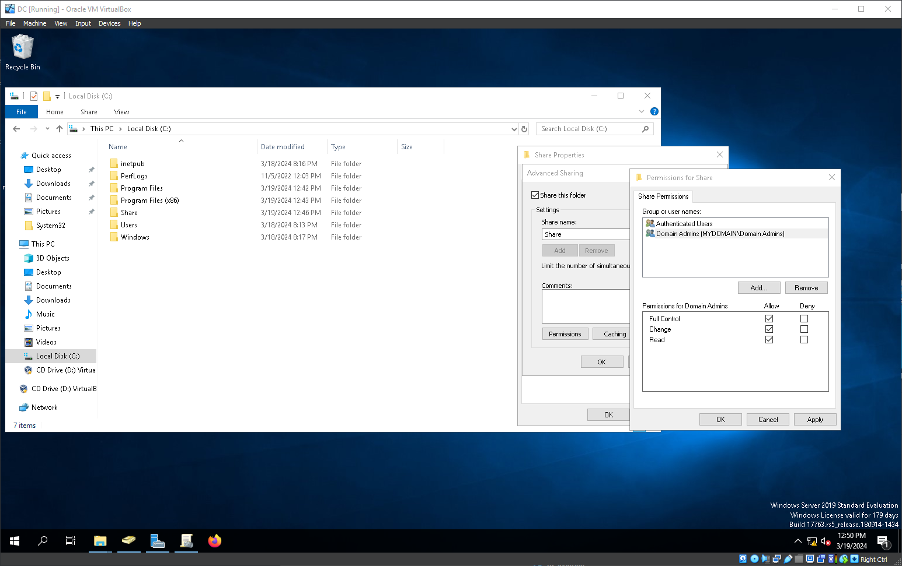
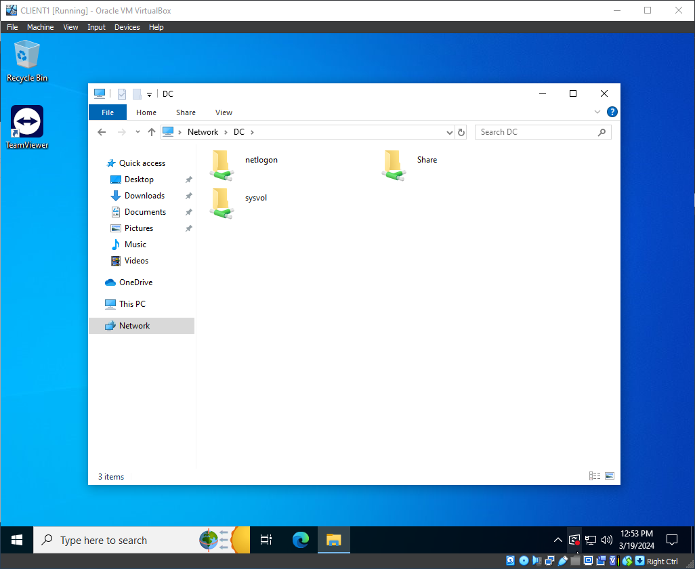
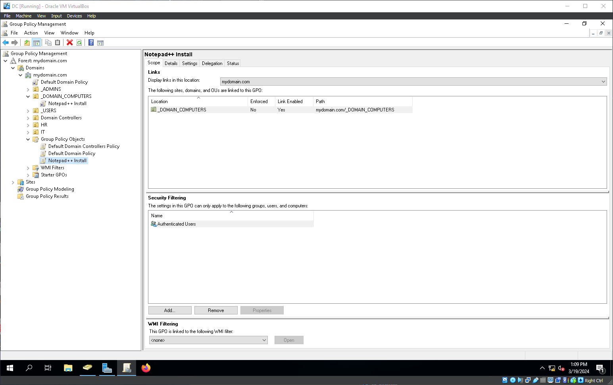
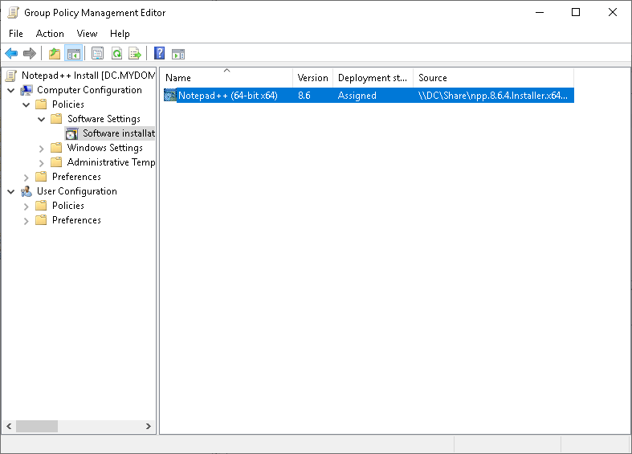
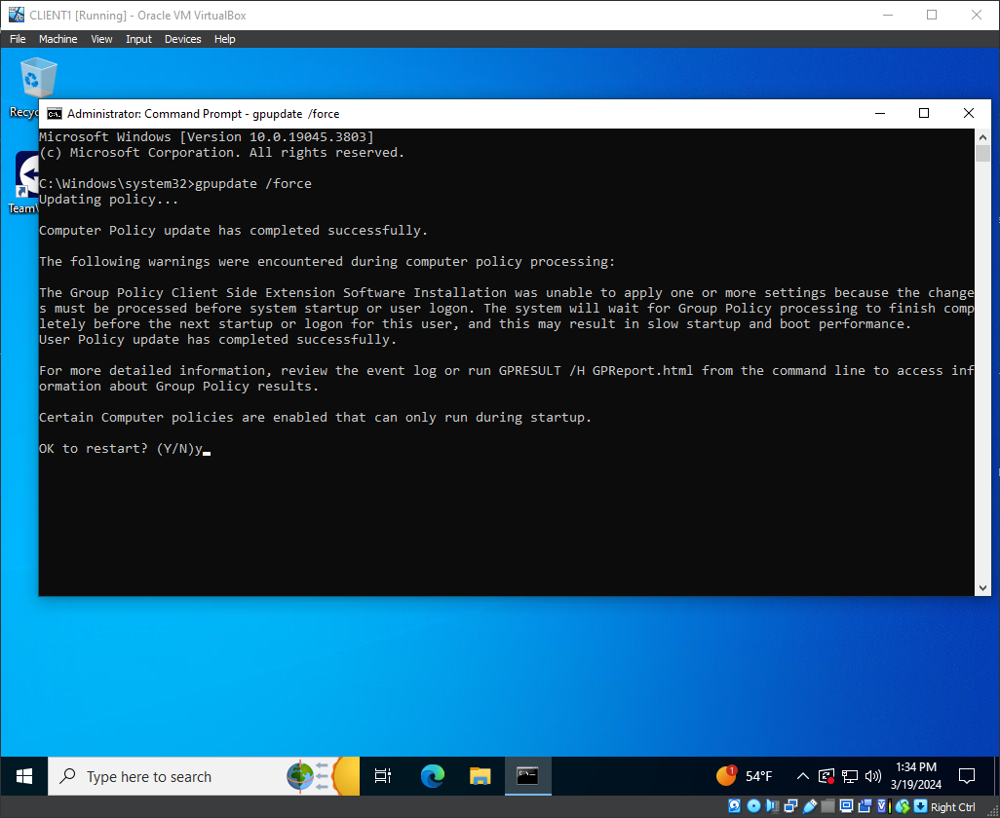
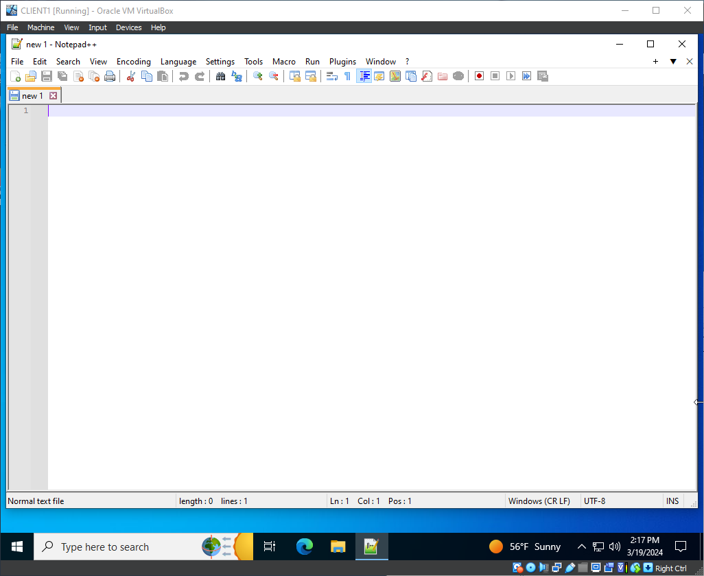
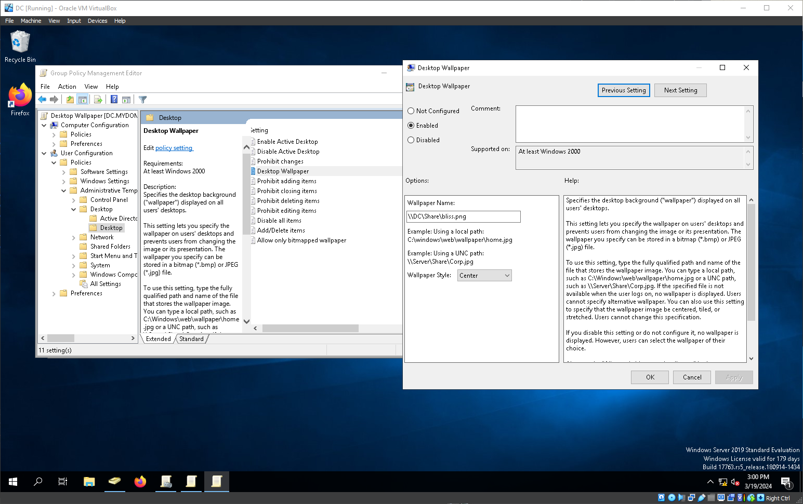
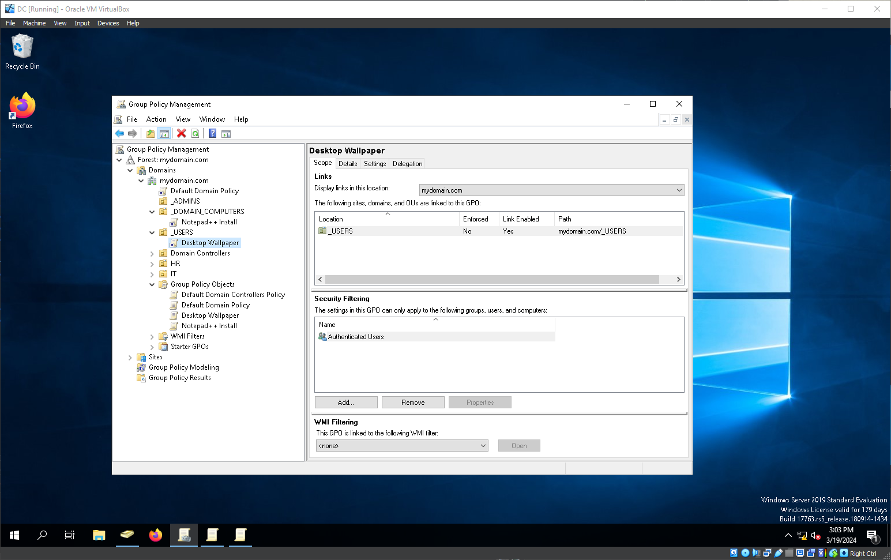
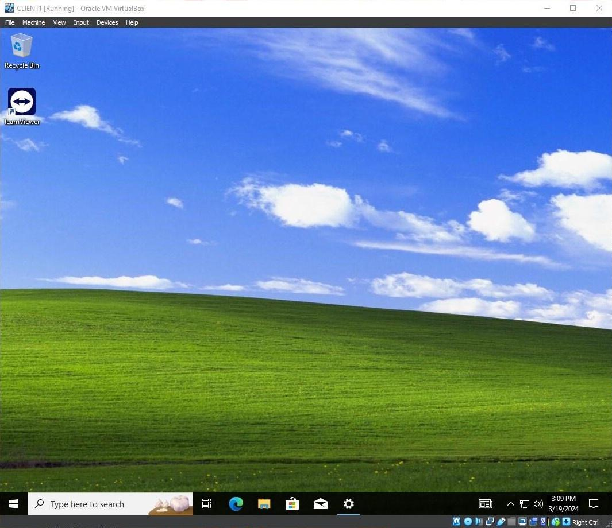

# Deploying Software With Group Policy

## Overview

This lab covers creating Group Policy Objects to automate software deployment and desktop configuration across Windows 10 clients. A GPO is used to silently install Notepad++ from a network share and a second GPO sets a desktop wallpaper for all domain users.

## Environment

- **Domain Controller:** Windows Server 2019 (17763)
- **Client:** Windows 10 (22H2)
- **Platform:** VirtualBox

---

## Network Share Setup

A folder named `Share` was created on the Domain Controller containing the Notepad++ installer and a wallpaper image. Share permissions were configured to give Authenticated Users read access and Domain Admins full control. The share is accessible from clients via `\\DC\Share`.

---

## Notepad++ Deployment

A GPO named `Notepad++ Install` was linked to the `_DOMAIN_COMPUTERS` OU. Under Group Policy Management Editor, a software installation package was created pointing to the Notepad++ installer on the network share.

One thing worth noting: Notepad++ ships as an `.exe` rather than an `.msi`, and Group Policy software installation only supports `.msi` packages. To work around this, the installer was repackaged as an `.msi` using WiX Toolset. The WiX source file is included in this repo.

`gpupdate /force` was run on the client to trigger the policy immediately rather than waiting for the next refresh cycle.

After restarting, Notepad++ was installed on the client without any manual intervention.

---

## Desktop Wallpaper Policy

A second GPO was created to set a desktop wallpaper for all domain users. This GPO was linked to the `_USERS` OU rather than `_DOMAIN_COMPUTERS` so it applies per user regardless of which machine they log into. Admin accounts in `_ADMINS` are excluded since that OU is outside the scope of this GPO.

After running `gpupdate /force` and restarting, the wallpaper was applied to the client.

